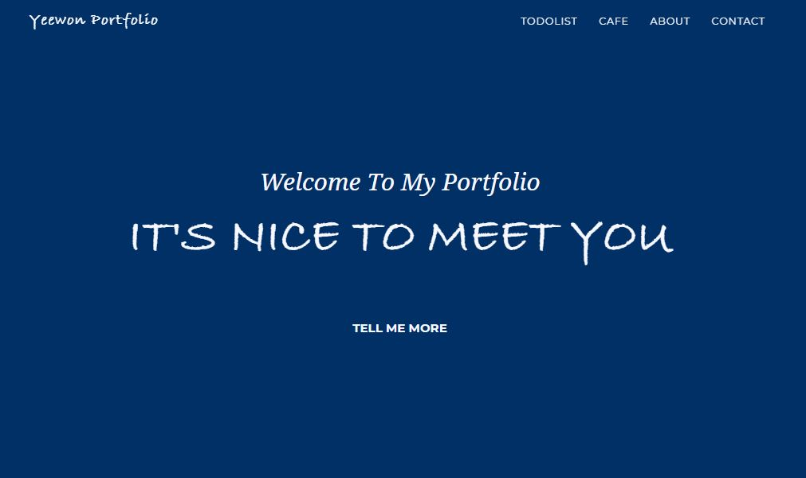
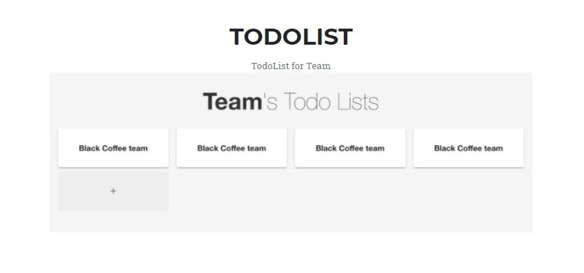
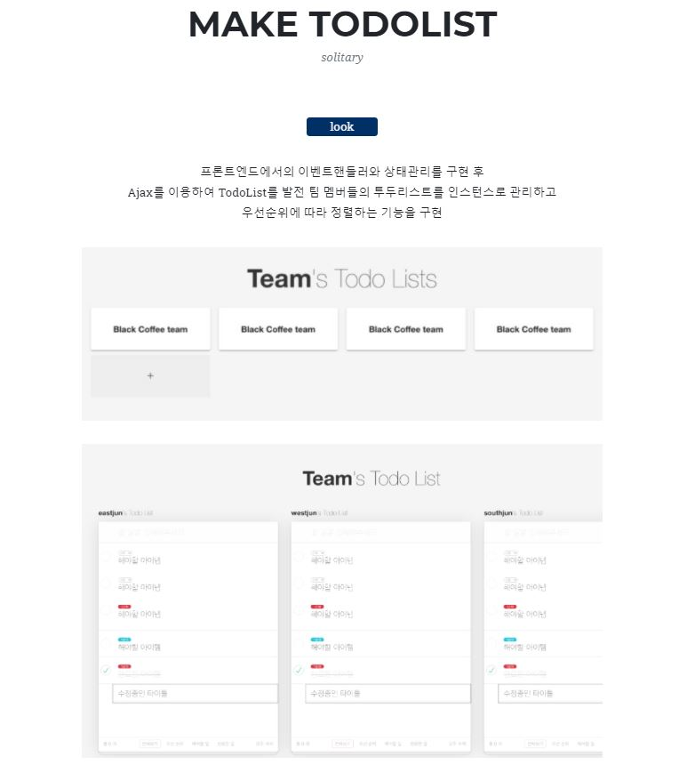
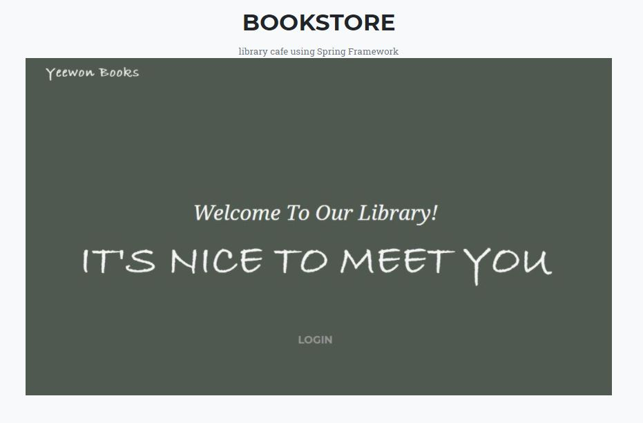
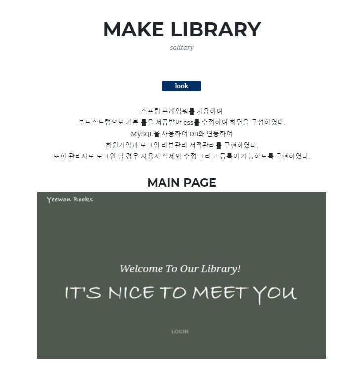

  

<h2 align="middle">My Portfolio</h2>

자바스크립트와 AJAX를 이용하여 구현한 투두리스트
 

 그리고

스프링프레임워크를 이용하여 구현한 서점 사이트

  
  
  
  
  
  

## 🔥 Projects!

  <h2 align="middle">TODO LIST</h2>
  
  

  <h2 align="middle">BOOKSTORE</h2>
  
  

  <a href="">🖥️ 데모 링크</a>

 
