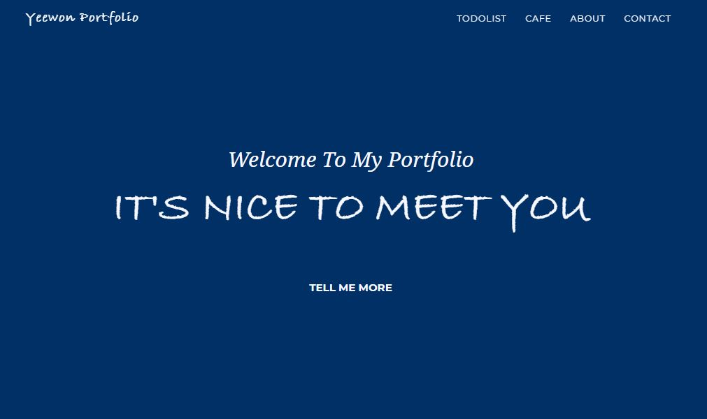
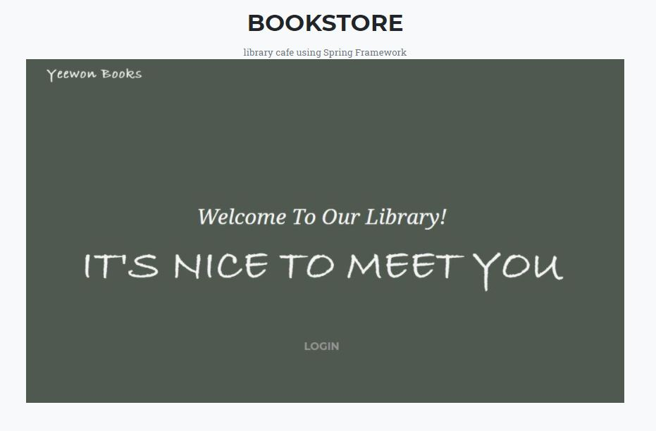
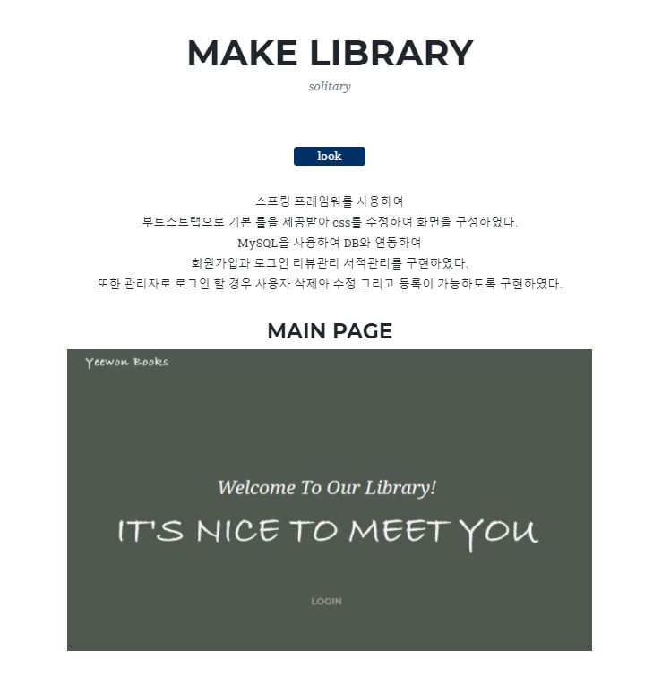
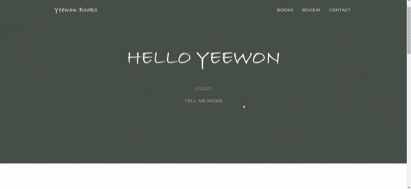
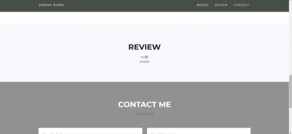
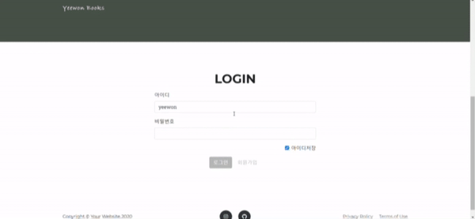

  

스프링프레임워크를 이용하여 구현한 서점 사이트

  
  
  
  
  
  

  <h2 align="middle">BOOKSTORE</h2>
  

    
    
  

  <h2 align="middle">🖥️ 데모 영상</h2>
    <h3>LOGIN</h3>
    
    <h3>BOOKLIST</h3>
    
    <h3>REVIEW</h3>
    
    <h3>ADMIN PAGE</h3>
    

 

## 디렉토리 구조

